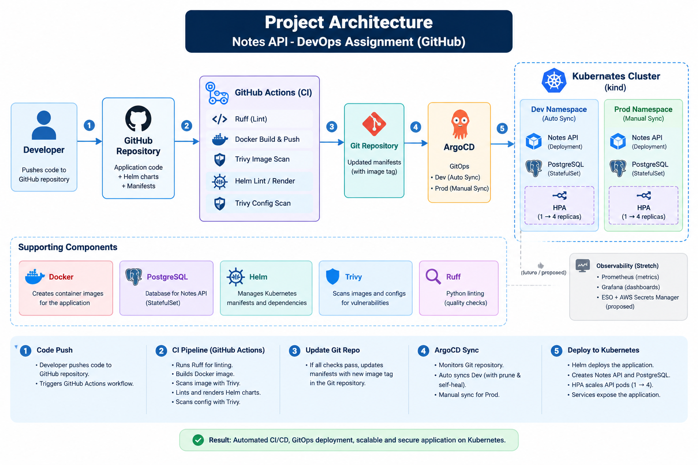
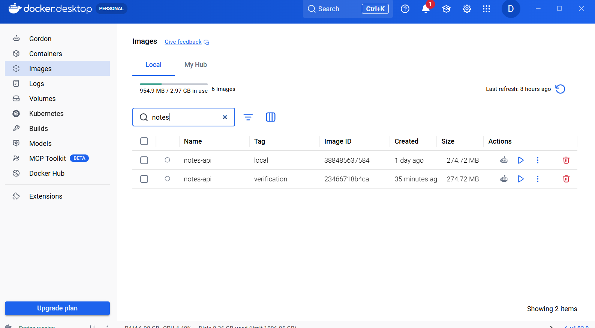
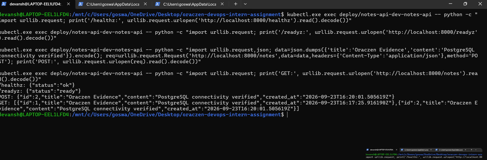
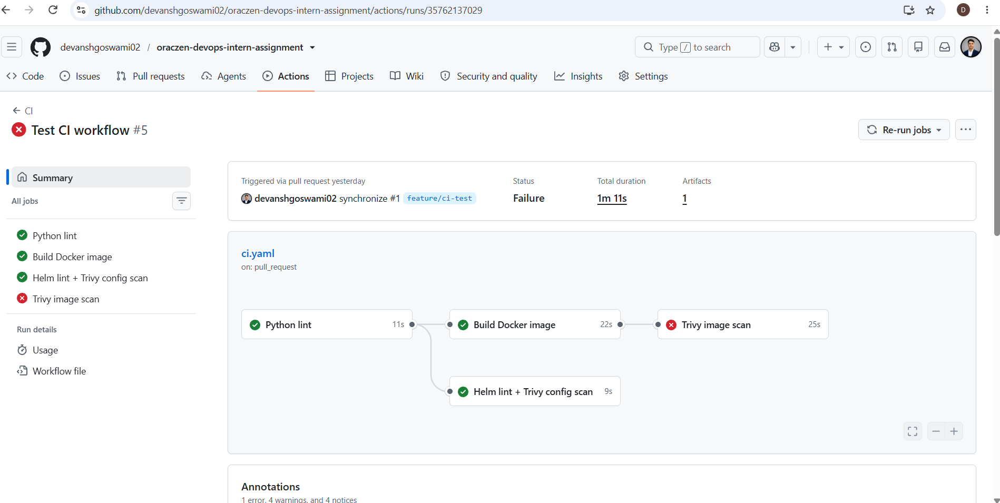
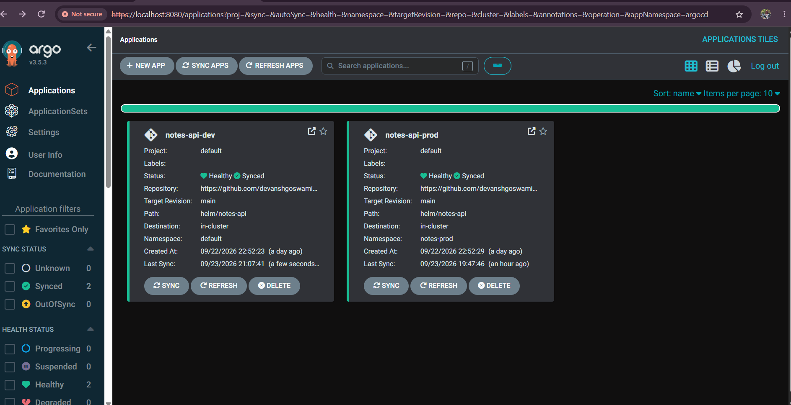
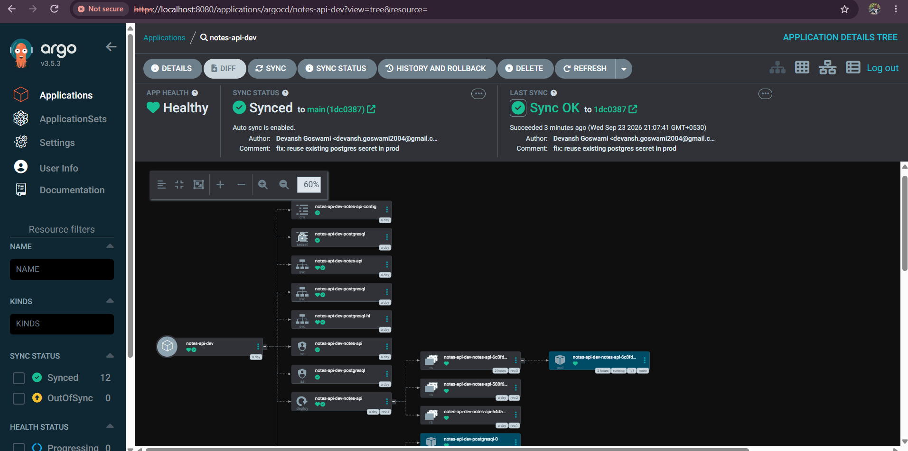
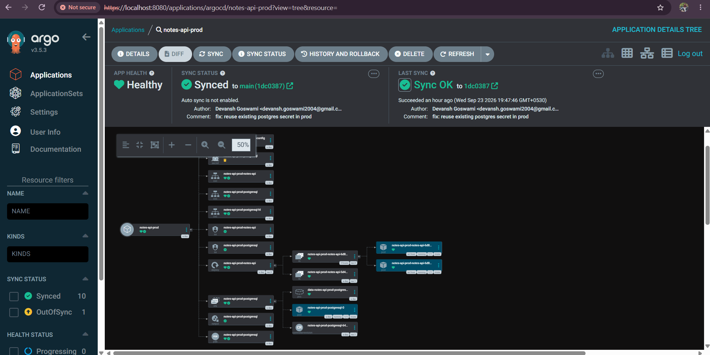
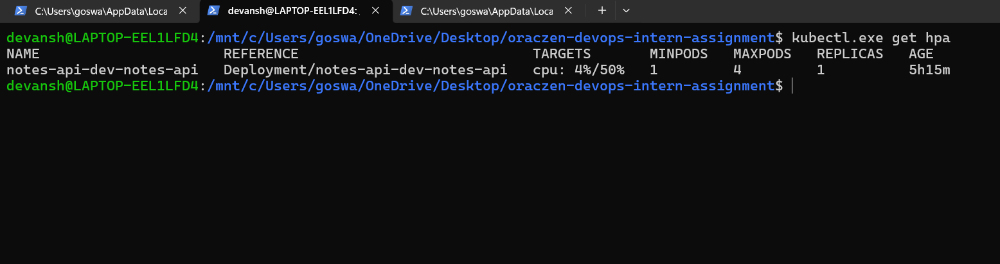

# Oraczen DevOps Intern Assignment

A hands-on DevOps implementation for a FastAPI + PostgreSQL Notes API, covering containerization, Helm, Kubernetes, CI security scanning, and GitOps with ArgoCD.

The goal of this assignment was to build the infrastructure and deployment workflow around the provided application without modifying the application logic.

---

## Architecture

The following diagram shows the overall CI/CD and GitOps flow used in this assignment, including GitHub Actions, ArgoCD, Kubernetes, the Notes API, PostgreSQL, and the development HPA.



## Project Overview

This project implements a local production-style DevOps workflow:

```text
Developer
   |
   | Git Push / Pull Request
   v
GitHub
   |
   v
GitHub Actions
   |
   +--> Python linting
   |
   +--> Docker image build
   |
   +--> Trivy image security scan
   |
   +--> Helm lint / render
   |
   +--> Trivy Kubernetes configuration scan
   |
   v
Git Repository
   |
   v
ArgoCD
   |
   +-------------------+
   |                   |
   v                   v
Development          Production
   |                   |
   v                   v
Kubernetes           Kubernetes
   |                   |
   +------ PostgreSQL-+
```

The application runs locally on a Kubernetes `kind` cluster.

---

## Environment

| Component | Version / Details |
|---|---|
| OS | Windows + WSL2 Ubuntu |
| Docker | Docker Desktop / Docker 29.8.0 |
| Kubernetes | kind |
| kind | v0.33.0 |
| kubectl | v1.36.1 |
| Helm | v3.22.0 |
| Kubernetes cluster | `oraczen` |
| CI | GitHub Actions |
| GitOps | ArgoCD |
| Database | PostgreSQL |
| Container scanning | Trivy |
| Python linting | Ruff |

The assignment was implemented locally. AWS EKS deployment was not required for the assignment.

---

# Technologies Used

- Docker
- Python 3.12
- FastAPI
- PostgreSQL
- Kubernetes
- kind
- Helm
- GitHub Actions
- Trivy
- ArgoCD
- Git
- Ruff
- HPA
- Linux / WSL2

---

# Repository Structure

```text
oraczen-devops-intern-assignment/
│
├── app/
│   ├── Dockerfile
│   ├── .dockerignore
│   ├── main.py
│   ├── database.py
│   ├── models.py
│   ├── schemas.py
│   └── requirements.txt
│
├── helm/
│   └── notes-api/
│       ├── Chart.yaml
│       ├── Chart.lock
│       ├── values.yaml
│       ├── values-dev.yaml
│       ├── values-prod.yaml
│       ├── charts/
│       │   └── postgresql-18.11.6.tgz
│       └── templates/
│           ├── _helpers.tpl
│           ├── configmap.yaml
│           ├── deployment.yaml
│           ├── hpa.yaml
│           ├── NOTES.txt
│           ├── service.yaml
│           └── serviceaccount.yaml
│
├── argocd/
│   ├── application-dev.yaml
│   └── application-prod.yaml
│
├── docs/
│   ├── observability.md
│   └── secrets-management-proposal.md
│
├── .github/
│   └── workflows/
│       └── ci.yaml
│
├── screenshots/
│   ├── part-1-docker/
│   ├── part-2-kubernetes/
│   ├── part-3-ci/
│   ├── part-4-argocd/
│   ├── part-5-stretch/
│   └── final-validation/
│
├── ASSIGNMENT.md
├── README.md
└── WRITEUP.md
```

---

# Part 1 — Docker

The provided FastAPI application was containerized using a multi-stage Docker build.

### Implemented

- Python 3.12 slim base image
- Multi-stage build
- Dependency installation in builder stage
- Non-root `appuser`
- Selective application file copying
- `PYTHONUNBUFFERED`
- Docker `HEALTHCHECK`
- Uvicorn running on port `8000`

The application code itself was not modified.

### Docker verification

The image was built locally and tested with PostgreSQL.

The container was verified to:

- start successfully
- run as a non-root user
- expose the application on port `8000`
- respond successfully to `/healthz`
- respond successfully to `/readyz`

Image size was approximately **274 MB**.



---

# Part 2 — Helm and Kubernetes

The application was packaged as a Helm chart.

### Implemented Kubernetes resources

- Deployment
- Service
- ConfigMap
- ServiceAccount
- Horizontal Pod Autoscaler
- PostgreSQL dependency

PostgreSQL is included as a Bitnami Helm dependency.

```text
helm/notes-api/
├── Chart.yaml
├── values.yaml
├── values-dev.yaml
├── values-prod.yaml
├── charts/
└── templates/
```

### PostgreSQL

The PostgreSQL chart is configured as a Helm dependency.

The API connects to PostgreSQL using Kubernetes environment variables and a Secret reference.

The PostgreSQL password is not hard-coded into the application Deployment.

### Health checks

Kubernetes probes use:

```text
/healthz
/readyz
```

### Security hardening

The API container uses:

- `runAsNonRoot`
- UID 1000
- dropped Linux capabilities
- `allowPrivilegeEscalation: false`
- `readOnlyRootFilesystem: true`
- CPU and memory requests/limits




---

# Part 3 — GitHub Actions CI

A GitHub Actions workflow was created for Pull Requests targeting `main`.

The pipeline performs:

```text
Pull Request
     |
     v
Python lint
     |
     v
Docker build
     |
     v
Trivy image scan
     |
     v
Helm dependency build
     |
     v
Helm lint + render
     |
     v
Trivy Kubernetes configuration scan
```

### Python checks

Ruff is used for Python linting.

### Docker build

The image is tagged using the Git commit SHA.

Example:

```text
notes-api:<commit-sha>
```

### Trivy image scan

The image is scanned for:

- HIGH vulnerabilities
- CRITICAL vulnerabilities

The pipeline is configured to fail when applicable vulnerabilities are detected.

### Important CI result

The starter application's dependency chain contains known Starlette vulnerabilities.

The Trivy image scan correctly detected HIGH severity vulnerabilities.

The application code and starter dependency requirements were intentionally not modified because the assignment states not to modify the application logic.

Therefore, this project does **not** claim that the image security scan is completely green.

### Kubernetes configuration scan

Trivy configuration scanning initially identified Kubernetes security configuration issues.

The Deployment was hardened with:

- non-root execution
- dropped capabilities
- `allowPrivilegeEscalation: false`
- read-only root filesystem
- resource limits

After these changes, the Kubernetes configuration scan passed.



---

# Part 4 — GitOps with ArgoCD

ArgoCD was installed locally and configured with two Applications:

```text
notes-api-dev
notes-api-prod
```

Both Applications use the Git repository as their source of truth.

### Development

Development uses automated synchronization:

- automated sync
- prune enabled
- self-healing enabled
- namespace creation enabled

### Production

Production uses manual synchronization.

This allows a production deployment to be reviewed before synchronization.

### GitOps workflow

```text
Git Commit
    |
    v
GitHub
    |
    v
ArgoCD detects change
    |
    v
Helm rendering
    |
    v
Kubernetes resources
```







---

# Part 5 — Stretch Work

The optional stretch work was partially implemented and documented.

## HPA

Development has a Horizontal Pod Autoscaler configured with:

```text
Minimum replicas: 1
Maximum replicas: 4
Target CPU: 50%
```

A load test was performed and the application scaled up under CPU load and later returned to the lower replica count when the load stopped.



## Observability

Prometheus scrape annotations were added to the Deployment as hooks for future monitoring integration.

The starter application does not provide a `/metrics` endpoint, so a complete Prometheus/Grafana implementation was not added.

The observability approach is documented in:

```text
docs/observability.md
```

## Secrets Management

A production-oriented secrets management proposal was documented.

The proposed approach is:

```text
AWS Secrets Manager
        |
        v
External Secrets Operator
        |
        v
Kubernetes Secret
        |
        v
Application
```

The proposal is documented in:

```text
docs/secrets-management-proposal.md
```

---

# Troubleshooting Highlights

Several real deployment issues were encountered during implementation.

### PostgreSQL credential mismatch

A PostgreSQL password mismatch caused new API pods to fail authentication.

The issue was diagnosed by comparing the password hashes used by the running application and Kubernetes Secret without exposing the actual password.

The production configuration was then updated to reuse the existing PostgreSQL Secret.

### ArgoCD Secret drift

ArgoCD reported the PostgreSQL Secret as extraneous/out of sync even though the Secret was intentionally managed outside Git.

The Secret was configured with:

```text
argocd.argoproj.io/compare-options=IgnoreExtraneous
```

This allowed the live Secret to remain outside the Git repository while keeping the Application healthy.

These troubleshooting steps are described in more detail in `WRITEUP.md`.

---

# Validation

The final environment was validated with:

```bash
kubectl get pods
kubectl get svc
kubectl get hpa
kubectl get applications -n argocd
```

The final state included:

- Dev ArgoCD Application: Synced / Healthy
- Prod ArgoCD Application: Synced / Healthy
- PostgreSQL running
- API pods running
- HPA configured
- Kubernetes resources managed through ArgoCD


---

# Documentation

Detailed implementation and troubleshooting notes are available in:

- [Assignment](ASSIGNMENT.md)
- [Detailed Write-up](WRITEUP.md)
- [Secrets Management Proposal](docs/secrets-management-proposal.md)
- [Observability](docs/observability.md)

---

# What I Learned

Through this assignment I practiced:

- writing production-oriented Dockerfiles
- multi-stage Docker builds
- running containers as non-root
- Kubernetes Deployments and Services
- Helm chart development
- Helm dependencies
- PostgreSQL deployment
- Kubernetes Secrets
- readiness and liveness probes
- Kubernetes security contexts
- resource requests and limits
- Horizontal Pod Autoscaling
- GitHub Actions
- Trivy security scanning
- Helm validation in CI
- ArgoCD
- GitOps workflows
- troubleshooting Kubernetes deployments
- debugging PostgreSQL authentication issues
- handling configuration drift in GitOps

---

# Future Improvements

If this were extended into a real production deployment, I would consider:

- AWS EKS
- AWS Secrets Manager + External Secrets Operator
- IRSA
- private container registry
- Prometheus and Grafana
- centralized logging
- image signing with Cosign
- SBOM generation
- stronger CI/CD release controls
- separate Kubernetes namespaces for environments

These are future improvements and are not claimed as part of the current local implementation.

---

# Author

**Devansh Goswami**

MCA Student | Aspiring Cloud / DevOps Engineer

GitHub: [devanshgoswami02](https://github.com/devanshgoswami02)

---

## Note

This project was implemented as a hands-on DevOps assignment using a local Kubernetes environment. The provided FastAPI application logic was kept unchanged; the work focused on containerization, deployment, security, CI, and GitOps.